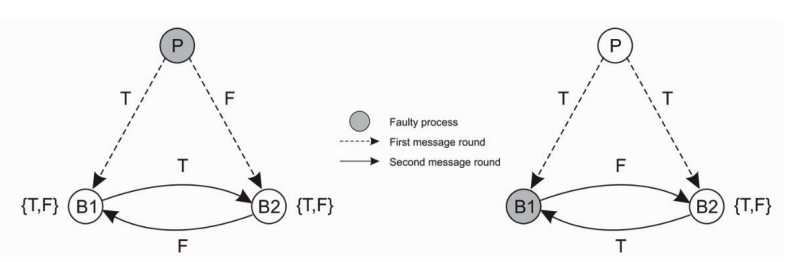

# Mini-project-2

## Requirements
- Python version 3.X (We used 3.9)
- sockets

## Video link

https://youtu.be/_5E4h7HO6jc

Sorry, the video is a bit longer then required but this was need in order to complete all the commands.

## How to run the program
Run ```python3 Generals_Byzantine_program.py <number of generals>```

## Commands

- ```actual-order order```: give the order to attack or retreat
- ```g-state ID State```: define a new state for the node if id ID (if no parameters are passed, it lists the nodes and their states)
- ```g-kill ID Kill```: kill the general
- ```g-add n```: adds n new generals
- ```exit```: exits the program

## Requirement for Byzantine Agreement(3k+1)

As explained in the Appendix, it is required at least 3k+1 members to reach consensus under the failure assumptions. Therefore our implementation follows this rule. However during a question asked in the chat about: as shown on the picture below B1 is faulty and can either send "attack" or "retreat" (50/50) probability. In this case for example:
- After the second round B1 will have {T,T} and B2 {T,F} leading to T for B1 as majority and undefined for B2
- However as the probability is (50/50) when a general is faulty, therefore this scenario can also happen: after the second round both B1 and B2 can have {T,T}. A follow up question was asked in the chat (on Slack) and as of now, there is not an answer that was provided. The description says we should use the 3k+1 in order to reach consencus but in this case above: B1 {T,T} and B2 {T,T} event though they all will agree but it violate the rule 3k+1. 
- Using this solution provided in the chat will therefore violate the rule: "if both B1 and B2 get the majority attack,  Execute order: attack! 1 faulty node in the system – 2 out of 3 quorum suggest attack".



This problem is shown on the video from 1:50-2:30


## Working method
We used the following working method:
- Perseverance Ngoy worked on the programm in python
- Emmanuel worked on the programm in java


In the end, we choose the python version as it was complete and worked.
Emmanuel had a hard time in java working with the sockets, which is why we used the python version in the end.
We worked together on Perseverance computer at Delta.

## Base code
Inspired from: https://github.com/macsnoeren/python-p2p-network 

<p align="center">Made with ❤ by Perseverance Ngoy and Emmanuel Cousin</p>